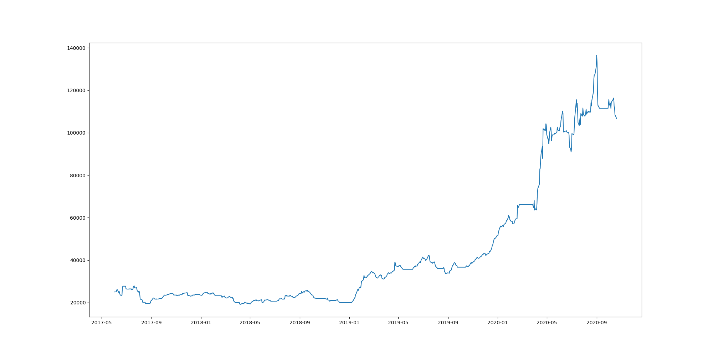

# FlowAlgo Trader

Trade on options flow from [flowalgo.com](http://flowalgo.com/) with live testing using [Alpaca](https://alpaca.markets/).

🚧 Paper trader under construction 🚧

## Strategy

The stategy involves pulling options flow and trading on it using a rules-based algorithm. The model will take a positions in the underlying asset if it is seen enough times and passes a set of rules. All metrics and rules are only applied to options seen that day.

Potential rules:
| rule | default | note |
| ---- | ------- | ---- |
| min_time | 9:45 | Ignore options before this time. |
| sell_after_gain | 0.15 | Sell position eod after gain |
| sell_after_loss | -0.06 | Sell position eod after loss |
| sell_perc_to_expiry | 1 | Sell when % days to expiry is reached |
| top_n_tickers | 50 | Only consider top n stocks in terms of option frequency |
| duplicate_pos | True | Take position if already in that stock |
| put_penalty | -1 | Penalty to frequency when PUT contract is seen |
| call_occurences | 2 | Minimum number of calls before considering |
| cp_ratio_min | 0 | Minimum overall call/put ratio |
| max_days_to_exp | 7 | Maximum days to expiry |
| min_premium | 20000 | Minimum premium for option contracts |
| max_premium | 1000000 | Maximum premium for option contracts |
| unusual_only | False | Only consider options flagged as unusual |
| allow_SWEEP | True | Consider SWEEP order types |
| allow_BLOCK | True | Consider BLOCK order types |
| allow_SPLIT | True | Consider SPLIT order types |
| spy_ema | True | Only trade if SPY is above EMA |
| spy_ema_val | 13 | EMA window if spy_ema is True |

There are many more rules you could encode (such as how far otm a contract is). This is only a LONG strategy. Finding short positions has proven to be much more difficult and hasn't showed much promise in backtesting. Also note that option data does not indicate any consensus on market direction as options are often used to hedge other positions. Another consideration is that many options will be part of a options trade that is constructed with more than one option type, strike price, or expiration date on the same underlying asset. Therefore, a large PUT contract could be a bearish position or it could be bullish as it could be hedging a long position or be part of a options combo.

## BackTest

Historical option flow can be downloaded from [flowalgo.com/options-export-beta](https://app.flowalgo.com/options-export-beta/). Put all downloaded CSVs in the `hist_data` directory and run `backtest.py`. See `run_test()` for backtesting parameters. The defaults are parameters I have chosen using grid search.

### Results



| metric            | score                            |
| ----------------- | -------------------------------- |
| balance           | \$25,000 -> \$110,261            |
| return            | 341.04%                          |
| annualized return | 55.05%                           |
| average loss      | -1.3739%                         |
| IR                | 2.361                            |
| biggest drawdown  | -31.38% ($27892.97 to $19138.93) |

⚠️ NOTE: The backfill results are due to overfitting via parameter selection. The model should be tested on more unseen data before trusting results. Also note that the model did not perform well in 2017 and 2018. Much of the gains were obtained during the market volatility induced by COVID-19.

### env

Create `.env` file with the following variables:

```
FLOW_EMAIL=email
FLOW_PASS=password
APCA_API_BASE_URL="https://paper-api.alpaca.markets"
APCA_API_KEY_ID=key
APCA_API_SECRET_KEY=secret
```

FlowAlgo credentials are required for scraping option flow and the Alpaca credentials are required for backtesting
